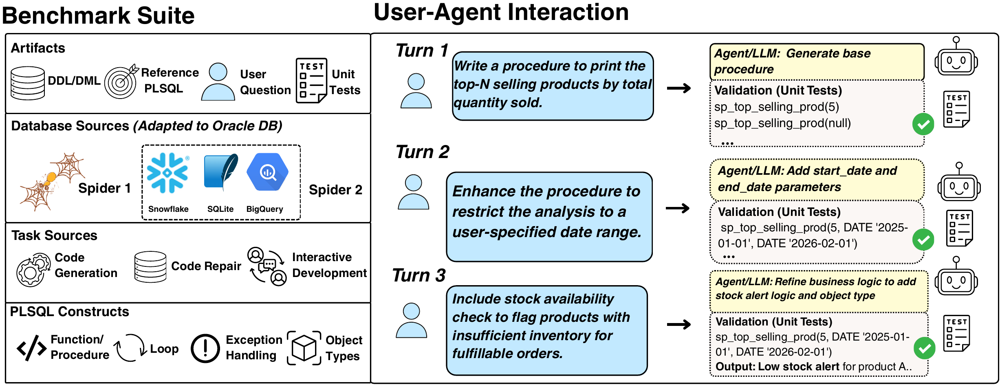

# PLSQLBench: Benchmarking LLM Systems for Executable Procedural Database Programming

| [Paper](https://arxiv.org/abs/2608.15931) | [Benchmark Website](https://plsqlbench.github.io/#benchmark) |

## Overview

PLSQLBench evaluates language-model systems on executable PL/SQL for Oracle
Database. To our knowledge, the accompanying paper introduces the first
benchmark dedicated to executable procedural database programming, covering
code generation, code repair, and interactive development with
execution-based evaluation.

[](assets/plsqlbench-overview.pdf)

The full benchmark contains 2,865 instances:
2,594 single-turn tasks and 271 multi-turn
conversations spanning 978 turns. Public release
v2 contains 2,391 development instances; the
remaining 474 instances are private holdouts.

PLSQLBench is designed for read-only evaluation. Benchmark tasks do not require
persistent `INSERT`, `UPDATE`, or `DELETE` operations, which supports safe,
repeatable execution without changing benchmark tables.

## Benchmark composition

PLSQLBench draws on three source families and defines five task subsets:

- **Spider2-ST** contains single-turn PL/SQL tasks over Oracle-normalized
  Spider 2.0 Lite schemas.
- **Spider2-MT** contains multi-turn conversations over the same schema family.
- **Spider-PLSQL** derives procedural database tasks from Spider 1.0.
- **MBPP-PLSQL** and **MBPP+-PLSQL** adapt function-generation problems and
  executable tests from MBPP and MBPP+ to Oracle PL/SQL.

The first four rows below are the public development data. The final three
benchmark rows are `test` datasets and **private holdout sets**; only their
aggregate statistics are published here. Private prompts, answers, executable
tests, metadata, and test-only schema tables are not release artifacts.

| Benchmark | Inst. | #DB | #Test (Avg.) |
| --- | ---: | ---: | ---: |
| Spider2-ST-dev | 407 | 26 | 4.9 |
| Spider2-MT-dev | 208 | 26 | 13.7 |
| Spider-PLSQL | 970 | 20 | 1.0 |
| MBPP-PLSQL† | 806 | -- | 3.0 |
| Spider2-ST-test | 103 | 8 | 4.7 |
| Spider2-MT-test | 63 | 7 | 13.0 |
| MBPP+-PLSQL† | 308 | -- | 91.7 |
| PLSQLBench (Overall) | 2,865 | 54 | 2.9 |

For Spider2-MT, an instance is a complete conversation and `#Test (Avg.)` is
the average number of executable tests across all turns in that conversation.

† MBPP-derived function-generation tasks do not require persistent database
tables, although some use Oracle object or collection types.

## Released data

The public package is data-only and contains:

- `datasets/`: the MBPP-PLSQL, Spider-PLSQL, Spider2-ST-dev, and Spider2-MT-dev
  JSONL files.
- `metadata/`: optional difficulty and reasoning annotations for the released
  Spider2 development rows.
- `schema/`: six Spider and Spider2 DDL/DML JSON or JSONL files for preparing
  schema-backed tasks.

The four Spider2 schema files are Oracle-dialect conversions of
[Spider 2.0 Lite](https://github.com/xlang-ai/Spider2/tree/main/spider2-lite):

- `schema/spider2_plsql/bigquery/` contains the **BigQuery-to-Oracle
  conversion**.
- `schema/spider2_plsql/snowflake_sqlite/` contains the
  **Snowflake/SQLite-to-Oracle conversion**.

The Spider2 DDL/DML is filtered to the
210 concrete tables required by the two
public development datasets. Eight of those tables are also referenced by the
withheld test partitions and remain because public development tasks depend on
them; no test-only tables are included. Spider and Spider2 DML keep at most
10,000 selected rows per Oracle owner. These DML records
initialize benchmark state; they are not task instructions.

MBPP+-PLSQL and both Spider2 test partitions remain private and appear only as
aggregate rows in the benchmark table.

## Getting Started

Clone or download the repository and work from the release root. The package
has no installation, compilation, or deployment step.

### Prerequisites

- A JSON/JSONL reader. Python 3.11 or later is used in the examples below.
- An Oracle Database environment and database client only if you plan to create
  the schemas or execute the Oracle SQL and PL/SQL tasks.

### Required services

No Oracle Cloud service or other hosted service is required to inspect the
release. Executing benchmark tasks requires an Oracle Database environment that
you provide and configure. The release does not include credentials, connection
configuration, or a database loader.

### Schema data

The release is data-only and does not bundle Python loaders, runtime
dependencies, credentials, or a schema-population entrypoint. Use your own
database tooling to consume these six DDL/DML artifacts:

- `schema/spider/spider_ddl.jsonl`
- `schema/spider/spider_dml.json`
- `schema/spider2_plsql/bigquery/OUTPUT_DDL_dev.jsonl`
- `schema/spider2_plsql/bigquery/OUTPUT_DML_dev.jsonl`
- `schema/spider2_plsql/snowflake_sqlite/OUTPUT_DDL_dev.jsonl`
- `schema/spider2_plsql/snowflake_sqlite/OUTPUT_DML_dev.jsonl`

## Documentation

This README documents the released benchmark data, schemas, and evaluation
protocol. For the benchmark design, task construction, and reported results,
see the [PLSQLBench paper](https://arxiv.org/abs/2608.15931). For Oracle
Database and PL/SQL product documentation, see
[Oracle Database Documentation](https://docs.oracle.com/en/database/).

## Examples

Read the first public MBPP-PLSQL task:

```bash
python3.11 - <<'PY'
import json
from pathlib import Path

path = Path("datasets/mbpp/mbpp_plsql.jsonl")
with path.open(encoding="utf-8") as handle:
    task = json.loads(next(handle))
print(task["task_id"])
print(task["prompt"])
PY
```

Validate every JSONL record in the public dataset directories:

```bash
python3.11 - <<'PY'
import json
from pathlib import Path

for path in sorted(Path("datasets").rglob("*.jsonl")):
    with path.open(encoding="utf-8") as handle:
        for line_number, line in enumerate(handle, 1):
            json.loads(line)
    print(f"validated {path}")
PY
```

Use your own database tooling to apply the schema DDL and DML. Review the
target owner and table fields before executing SQL in an Oracle Database
environment that you control.

## Evaluation

PLSQLBench measures functional correctness with execution-based tests. For a
schema-backed task, prepare the corresponding Oracle schema, compile the
generated PL/SQL, run the task's tests, and compare its behavior with the
expected behavior. The paper reports Mean Test Pass@1 and Suite Pass@1; its
multi-turn evaluation also measures success across complete conversational
episodes.

For Spider2-MT, preserve conversation order and prior-turn context. Each
conversation is one benchmark instance, while executable tests are associated
with its individual turns. The standalone public package supplies data and
schema artifacts, not an Oracle database loader or end-to-end evaluation
service.

## Help

For questions or reproducible problems involving the public benchmark
artifacts, open a GitHub issue with the affected public instance ID and enough
information to reproduce the problem. Use your existing Oracle Support
channels for Oracle Database product support. Do not use GitHub issues to
report security vulnerabilities.

## Contributing

This project welcomes contributions from the community. Before submitting a
pull request, please review our [contribution guide](CONTRIBUTING.md), including
the Oracle Contributor Agreement and commit sign-off requirements.

## Security

See [SECURITY.md](SECURITY.md) for Oracle's vulnerability-reporting process.
Security vulnerabilities must not be reported through public GitHub issues.

## License

Copyright (c) 2026 Oracle and/or its affiliates.

PLSQLBench is licensed under the Creative Commons Attribution-ShareAlike 4.0
International License (CC BY-SA 4.0), except where otherwise noted. See
[LICENSE.txt](LICENSE.txt) for the license terms, [Attribution.txt](Attribution.txt)
for source-specific copyright and attribution information, and
[Third-Party-Licenses.txt](Third-Party-Licenses.txt) for third-party license
terms.

## Citation

If you use PLSQLBench, cite the paper:

```bibtex
@article{liu2026plsqlbench,
  title={PLSQLBench: Benchmarking LLM Systems for Executable Procedural Database Programming},
  author={Liu, Marianne Menglin and Boytsov, Leonid and Peterson, Daniel W and Perera, Pramuditha and Wang, Rongguang and Somayajula, Sai Ashish and Rafique, Syed Hamza and Saini, Rohit and Pathak, Shubham and Bharadwaj, Sujeeth and others},
  journal={arXiv preprint arXiv:2608.15931},
  year={2026}
}
```
